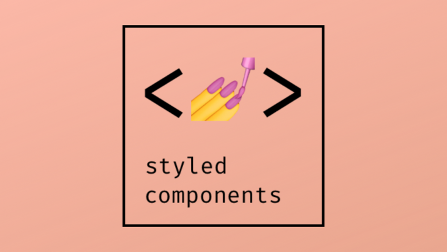

  

# Styled Component Library

This repo is student project attmpting to swow up how we could potetially setup a custom react project using the styled-components package implementing our own library according to our chart design. Of course, it can be possibly implemented with some most common UI Library such as Material UI, Ant Design, Chakra UI...

This approach of implementing UI interfaces allows us to build reusable components which can be so useful for customs projects that have to scale. This a common way of thinking and building design systems and can also quickly bring us to the storybooks approach.

This is NOT a finish product, but a quick repo, for the purpose of having a clear demo of what we could do with React implementing styled components. We built some components such as buttons, modal and also a dark & light theme context using here strictly React. And for sure, we can implement more by repeating the tasks if we want to have a complete library which is not the goal of this repo. 

## A react project from create react app

This project was bootstrapped with **[Create React App](https://github.com/facebook/create-react-app)**.
